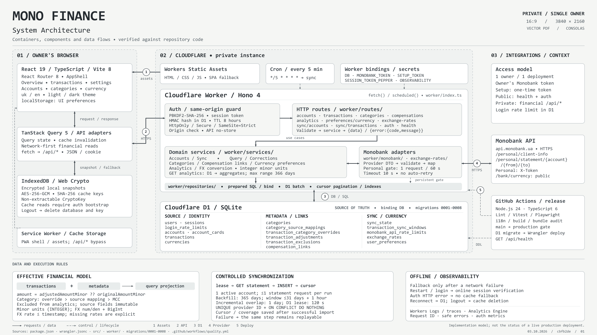

# Mono Finance architecture

Mono Finance is a self-hosted, single-owner personal-finance application. This
English-language diagram shows its containers, component boundaries, data flows,
authentication, storage, synchronization, and release pipeline.

[](mono-finance-architecture-4k.png)

Open the [full-size 4K image](mono-finance-architecture-4k.png) for detailed labels
or the [vector PDF](../../output/pdf/mono-finance-architecture-4k.pdf) for zooming
and printing. Both use a 16:9 layout, a neutral palette, and technical typography.

## Reading the diagram

- **Owner's browser:** React renders the application, TanStack Query manages
  request state, and feature API adapters call same-origin `/api/*`. IndexedDB
  stores encrypted snapshots; the service worker caches the public shell and
  static assets while bypassing API requests.
- **Cloudflare instance:** Workers Static Assets serves the frontend. The Hono
  Worker validates sessions and requests, dispatches thin HTTP routes to domain
  services, and uses repositories for parameterized D1 access. D1 remains the
  source of truth. Cron triggers bounded transaction-sync steps every five minutes.
- **External systems:** Server-only adapters call Monobank Personal and public
  exchange-rate APIs. GitHub Actions validates releases before D1 migrations,
  Wrangler deployment, and the health check.

Solid arrows represent requests or data. Dashed arrows represent control and
lifecycle operations. The lower panels describe immutable source records,
separate corrections, integer money, resumable synchronization, offline-session
requirements, and safe observability.

The diagram documents the repository's implementation rather than the live
status of a particular deployment. See the [root README](../../README.md) for API
contracts and operational details and [frontend ownership](../FRONTEND_STRUCTURE.md)
for browser module boundaries.

## Regenerating the inline image

The [vector PDF](../../output/pdf/mono-finance-architecture-4k.pdf) is the source
for the PNG preview. Run this command from the repository root with Poppler's
`pdftoppm` on `PATH`:

```sh
pdftoppm -r 72 -singlefile -png output/pdf/mono-finance-architecture-4k.pdf docs/architecture/mono-finance-architecture-4k
```

The resulting PNG is 3840 × 2160 pixels. Keep both files in sync when updating
the diagram. Relative image links render the preview in both READMEs without an
external image host or a diagram plugin.
